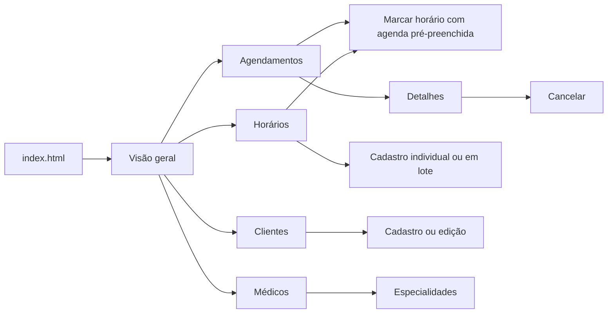
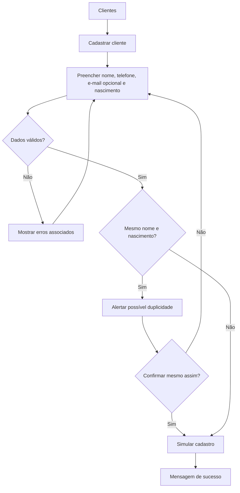
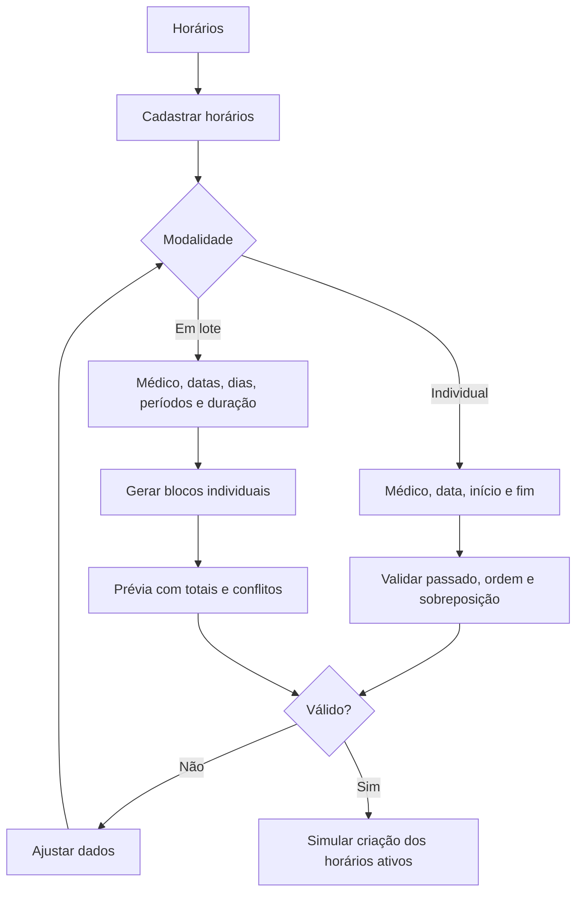
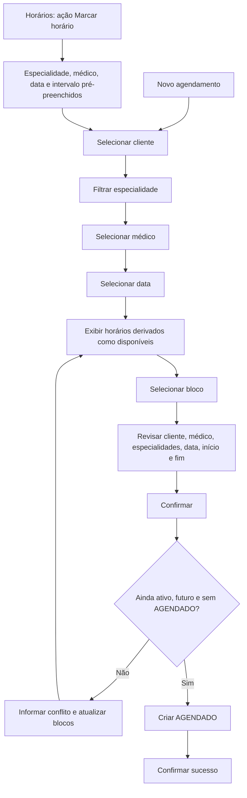
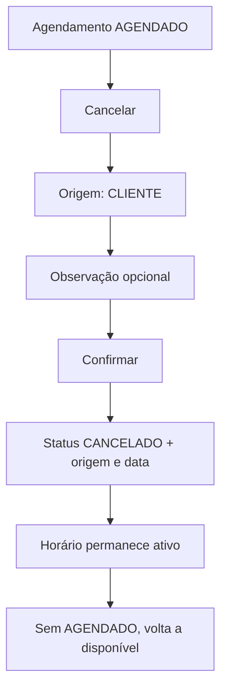
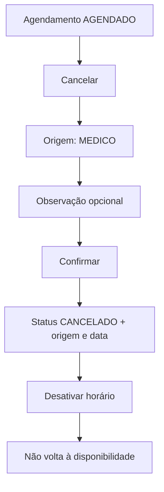
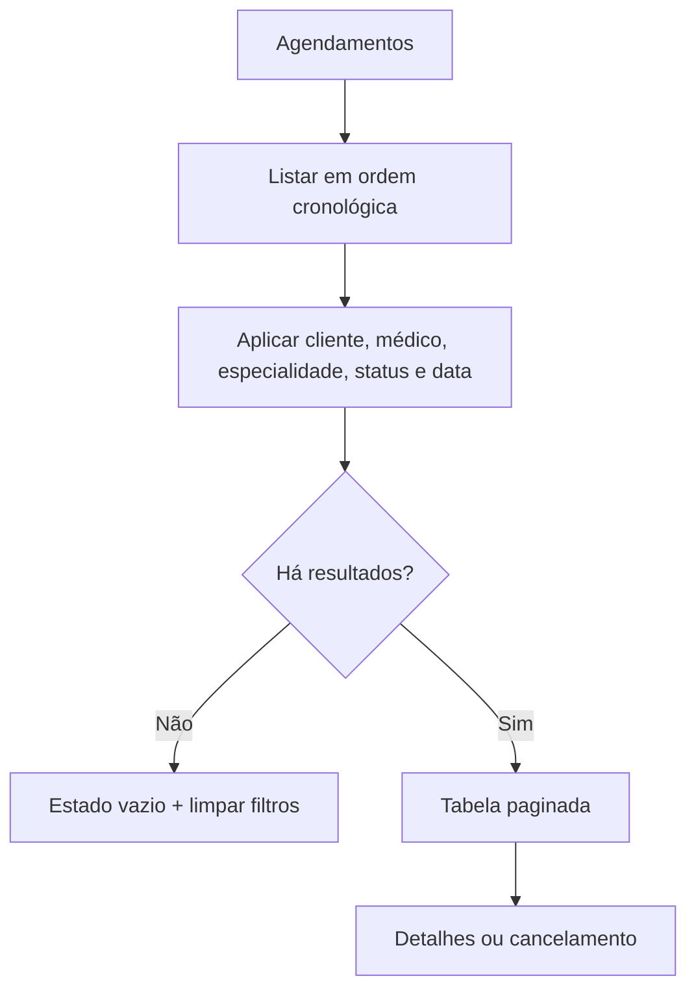
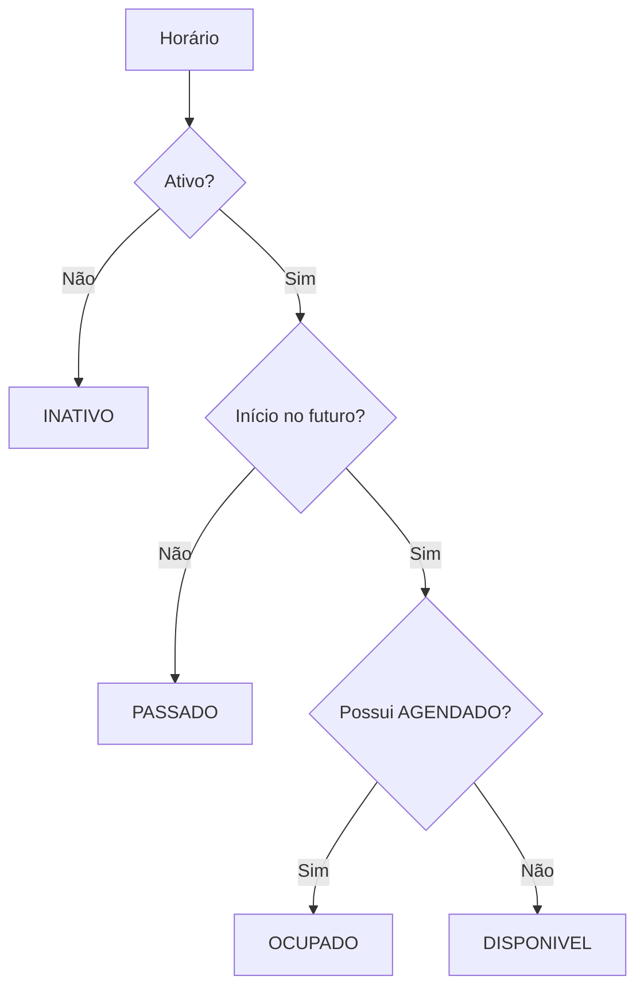

# Mapa de telas e fluxos

## Relação entre telas e casos de uso

| Tela | Arquivo | Casos de uso / requisitos |
|---|---|---|
| Launcher | `index.html` | Navegação do protótipo |
| Visão geral | `overview.html` | UC10, RF12 e ações para UC01, UC05, UC07 |
| Agendamentos | `agendamentos.html` | UC08, UC10, RF11–RF13 |
| Novo agendamento | `novo-agendamento.html` | UC07, RF09–RF10, RN05–RN06 |
| Detalhes | `agendamento-detalhes.html` | UC08, estados e histórico |
| Horários | `horarios.html` | UC06, UC09, RF06–RF07 |
| Cadastro de horários | `horario-form.html` | UC05, RF05, RF08, RN03–RN04, RN10 |
| Clientes | `clientes.html` | UC02, RF02 |
| Cadastro/edição de cliente | `cliente-form.html` | UC01, RF01, RN01 |
| Médicos | `medicos.html` | UC03, RF03, RN02 |
| Especialidades | `especialidades.html` | UC04, RF04 |

## Mapa de navegação

## Cadastrar cliente — UC01

## Cadastrar horários — UC05

## Realizar agendamento — UC07

## Cancelamento solicitado pelo cliente — UC08 / RN07

## Cancelamento causado pelo médico — UC08 / RN08

## Consultar próximos agendamentos — UC10

## Regra transversal de disponibilidade

