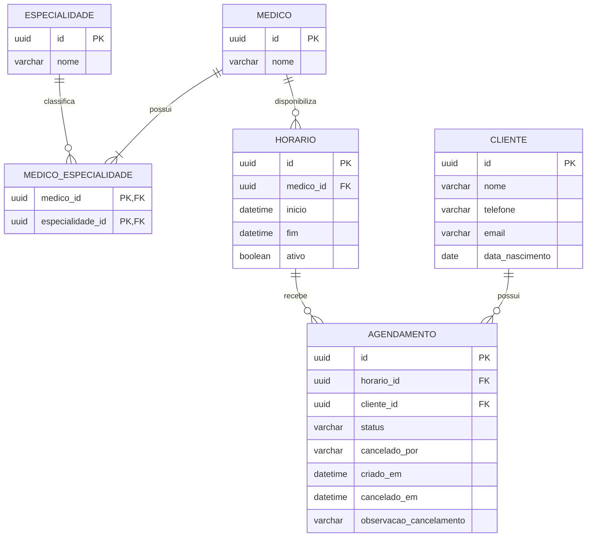

# Modelagem de Dados

## Visão geral

A modelagem de dados do sistema foi definida para representar os clientes, médicos, especialidades, horários disponíveis e agendamentos da clínica.

As entidades principais são:

- `CLIENTE`;
- `MEDICO`;
- `ESPECIALIDADE`;
- `MEDICO_ESPECIALIDADE`;
- `HORARIO`;
- `AGENDAMENTO`.

A entidade `MEDICO_ESPECIALIDADE` representa a relação entre médicos e especialidades, permitindo que um médico esteja associado a uma ou mais especialidades.

A disponibilidade dos horários não será armazenada diretamente em uma coluna. Ela será determinada a partir do estado do horário e da existência de um agendamento ativo associado.

---

## Diagrama Entidade-Relacionamento



---

## Entidades e atributos

### CLIENTE

Representa uma pessoa atendida pela clínica e que pode ser associada a um ou mais agendamentos.

| Campo             | Tipo    | Obrigatório | Descrição                        |
| ----------------- | ------- | ----------: | -------------------------------- |
| `id`              | UUID    |         Sim | Identificador único do cliente.  |
| `nome`            | VARCHAR |         Sim | Nome completo do cliente.        |
| `telefone`        | VARCHAR |         Sim | Telefone utilizado para contato. |
| `email`           | VARCHAR |         Não | Endereço de e-mail do cliente.   |
| `data_nascimento` | DATE    |         Sim | Data de nascimento do cliente.   |

#### Restrições

- `nome`, `telefone` e `data_nascimento` são obrigatórios;
- `email` é opcional;
- a data de nascimento não pode ser posterior à data atual;
- a combinação entre nome e data de nascimento será utilizada para identificar possíveis duplicidades;
- a identificação de uma possível duplicidade deverá gerar um alerta, sem necessariamente impedir o cadastro;
- um cliente não poderá ser excluído enquanto possuir agendamentos associados.

---

### MEDICO

Representa um médico que realiza atendimentos na clínica.

| Campo  | Tipo    | Obrigatório | Descrição                      |
| ------ | ------- | ----------: | ------------------------------ |
| `id`   | UUID    |         Sim | Identificador único do médico. |
| `nome` | VARCHAR |         Sim | Nome completo do médico.       |

As especialidades do médico não são armazenadas diretamente nessa tabela. Elas são representadas por meio da entidade associativa `MEDICO_ESPECIALIDADE`.

#### Restrições

- o nome do médico é obrigatório;
- todo médico deve estar associado a pelo menos uma especialidade para ser utilizado no cadastro de horários;
- um médico não poderá ser excluído enquanto possuir horários associados.

---

### ESPECIALIDADE

Representa uma área de atuação médica utilizada para classificar os médicos e facilitar as pesquisas do sistema.

| Campo  | Tipo    | Obrigatório | Descrição                             |
| ------ | ------- | ----------: | ------------------------------------- |
| `id`   | UUID    |         Sim | Identificador único da especialidade. |
| `nome` | VARCHAR |         Sim | Nome da especialidade.                |

#### Restrições

- o nome da especialidade é obrigatório;
- não devem existir duas especialidades com o mesmo nome;
- uma especialidade não poderá ser excluída enquanto estiver associada a algum médico.

---

### MEDICO_ESPECIALIDADE

Representa a relação muitos-para-muitos entre médicos e especialidades.

| Campo              | Tipo | Obrigatório | Descrição                   |
| ------------------ | ---- | ----------: | --------------------------- |
| `medico_id`        | UUID |         Sim | Referência ao médico.       |
| `especialidade_id` | UUID |         Sim | Referência à especialidade. |

A chave primária é composta por:

```text
medico_id + especialidade_id
```

Essa chave composta impede que a mesma especialidade seja associada mais de uma vez ao mesmo médico.

#### Exemplo

| medico_id | especialidade_id |
| --------- | ---------------- |
| Médico A  | Dermatologia     |
| Médico A  | Estética         |
| Médico B  | Dermatologia     |

Nesse exemplo, o Médico A possui duas especialidades, enquanto o Médico B possui apenas uma.

---

### HORARIO

Representa um bloco de tempo em que determinado médico poderá realizar um atendimento.

| Campo       | Tipo     | Obrigatório | Descrição                                      |
| ----------- | -------- | ----------: | ---------------------------------------------- |
| `id`        | UUID     |         Sim | Identificador único do horário.                |
| `medico_id` | UUID     |         Sim | Médico responsável pelo horário.               |
| `inicio`    | DATETIME |         Sim | Data e hora de início do bloco.                |
| `fim`       | DATETIME |         Sim | Data e hora de término do bloco.               |
| `ativo`     | BOOLEAN  |         Sim | Indica se o horário continua válido na agenda. |

Cada entrada na tabela representa um único bloco agendável.

Por exemplo, caso um médico possua os seguintes horários:

```text
08:00–09:00
09:00–10:00
10:00–11:00
14:00–15:00
15:00–16:00
16:00–17:00
```

serão criados seis registros na tabela `HORARIO`.

#### Restrições

- todo horário deve estar associado a um médico;
- `inicio` deve ser anterior a `fim`;
- não devem ser cadastrados horários no passado;
- um médico não pode possuir horários sobrepostos;
- médicos diferentes podem possuir horários no mesmo período;
- um horário inativo não pode receber novos agendamentos.

---

### AGENDAMENTO

Representa a associação entre um cliente e um horário de atendimento.

| Campo                     | Tipo     | Obrigatório | Descrição                                                               |
| ------------------------- | -------- | ----------: | ----------------------------------------------------------------------- |
| `id`                      | UUID     |         Sim | Identificador único do agendamento.                                     |
| `horario_id`              | UUID     |         Sim | Horário reservado.                                                      |
| `cliente_id`              | UUID     |         Sim | Cliente associado ao atendimento.                                       |
| `status`                  | VARCHAR  |         Sim | Estado armazenado do agendamento, limitado a `AGENDADO` ou `CANCELADO`. |
| `cancelado_por`           | VARCHAR  |         Não | Origem do cancelamento.                                                 |
| `criado_em`               | DATETIME |         Sim | Data e hora em que o agendamento foi criado.                            |
| `cancelado_em`            | DATETIME |         Não | Data e hora em que ocorreu o cancelamento.                              |
| `observacao_cancelamento` | VARCHAR  |         Não | Informação complementar sobre o cancelamento.                           |

#### Valores persistidos de `status`

O campo `status` deverá armazenar:

```text
AGENDADO
CANCELADO
```

O estado `CONCLUIDO` será calculado pelo sistema, não sendo necessário atualizar o registro no banco quando o atendimento terminar.

#### Valores de `cancelado_por`

```text
CLIENTE
MEDICO
```

Enquanto o agendamento não estiver cancelado, os seguintes campos permanecerão nulos:

- `cancelado_por`;
- `cancelado_em`;
- `observacao_cancelamento`.

#### Restrições

- todo agendamento deve estar associado a um cliente;
- todo agendamento deve estar associado a um horário;
- somente horários ativos, futuros e disponíveis podem ser agendados;
- um horário pode possuir apenas um agendamento com status `AGENDADO` por vez;
- agendamentos cancelados devem permanecer armazenados;
- um agendamento cancelado não pode ser cancelado novamente.

---

## Relacionamentos e cardinalidades

### Médico e especialidade

```text
MEDICO N ───── N ESPECIALIDADE
```

Um médico deve possuir uma ou mais especialidades.

Uma especialidade pode estar associada a nenhum ou a vários médicos.

A relação é implementada por meio da tabela `MEDICO_ESPECIALIDADE`.

---

### Médico e horário

```text
MEDICO 1 ───── N HORARIO
```

Um médico pode possuir vários horários.

Cada horário pertence a apenas um médico.

Essa associação permite que médicos diferentes possuam horários no mesmo período sem que isso seja considerado conflito.

---

### Cliente e agendamento

```text
CLIENTE 1 ───── N AGENDAMENTO
```

Um cliente pode possuir vários agendamentos.

Cada agendamento pertence a apenas um cliente.

---

### Horário e agendamento

```text
HORARIO 1 ───── N AGENDAMENTO
```

Um horário pode possuir vários agendamentos históricos, mas somente um agendamento ativo por vez.

Exemplo:

```text
Horário de 14:00–15:00
├── Agendamento de Ana — CANCELADO
└── Agendamento de Bruno — AGENDADO
```

Essa cardinalidade permite que um horário cancelado pelo cliente volte a ser utilizado sem apagar o agendamento anterior.

---

## Disponibilidade dos horários

A disponibilidade não será armazenada em uma coluna como `disponivel`.

Um horário será considerado disponível quando:

- estiver ativo;
- sua data e hora de início ainda não tiverem ocorrido;
- não possuir um agendamento com status `AGENDADO`.

Essa abordagem evita inconsistências, como um horário estar marcado como disponível mesmo possuindo um agendamento ativo.

---

## Estados do agendamento

O sistema apresentará três estados:

```text
AGENDADO
CANCELADO
CONCLUIDO
```

Entretanto, somente `AGENDADO` e `CANCELADO` serão armazenados diretamente no campo `status`.

O estado apresentado pelo sistema seguirá estas condições:

- será `CANCELADO` quando o status armazenado for `CANCELADO`;
- será `CONCLUIDO` quando não estiver cancelado e a data e hora de fim do horário já tiverem passado;
- será `AGENDADO` quando não estiver cancelado e o horário ainda não tiver terminado.

Dessa forma, não será necessário executar uma tarefa periódica para atualizar todos os agendamentos depois que seus horários terminarem.

O estado `CONCLUIDO` significa apenas que:

- o agendamento não foi cancelado;
- a data e hora de fim do horário já passaram.

---

## Cancelamento de agendamentos

### Cancelamento solicitado pelo cliente

Quando o cliente solicitar o cancelamento:

- o status do agendamento será alterado para `CANCELADO`;
- `cancelado_por` será preenchido com `CLIENTE`;
- `cancelado_em` receberá a data e hora do cancelamento;
- o horário permanecerá ativo.

Como o horário continua ativo e deixa de possuir um agendamento com status `AGENDADO`, ele volta automaticamente a ser considerado disponível.

---

### Cancelamento causado pelo médico

Quando o médico não puder realizar o atendimento:

- o status do agendamento será alterado para `CANCELADO`;
- `cancelado_por` será preenchido com `MEDICO`;
- `cancelado_em` receberá a data e hora do cancelamento;
- o horário será desativado.

O horário não voltará a aparecer como disponível.

A observação do cancelamento poderá ser preenchida nos dois casos, mas será opcional.

---

## Cadastro de horários em lote

O cadastro em lote será uma funcionalidade da aplicação e não exigirá uma tabela adicional.

O usuário poderá informar parâmetros como:

- médico;
- dias da semana;
- intervalo de datas;
- horário inicial e final de cada período;
- duração de cada atendimento.

O sistema utilizará esses parâmetros para gerar múltiplos registros na tabela `HORARIO`.

Por exemplo:

```text
Período: 08:00–12:00
Duração: 1 hora
```

Registros gerados:

```text
08:00–09:00
09:00–10:00
10:00–11:00
11:00–12:00
```

Cada bloco deverá ser validado individualmente antes da persistência.

Caso existam conflitos com a agenda do médico, o sistema deverá apresentar os horários conflitantes antes de concluir a operação.

Os parâmetros utilizados na geração não precisam ser armazenados, pois apenas os blocos efetivamente criados serão utilizados pelo restante do sistema.

---

## Restrições de integridade

A aplicação e o banco de dados deverão preservar as seguintes regras:

1. Toda chave primária deve utilizar UUID.
2. Todo horário deve estar associado a um médico existente.
3. Todo agendamento deve estar associado a um cliente e a um horário existentes.
4. O início de um horário deve ser anterior ao seu fim.
5. Um médico não pode possuir horários sobrepostos.
6. Médicos diferentes podem possuir horários simultâneos.
7. Um horário inativo não pode receber novos agendamentos.
8. Um horário pode possuir somente um agendamento com status `AGENDADO` por vez.
9. A disponibilidade deve ser validada novamente no backend antes da criação do agendamento.
10. A mesma especialidade não pode ser associada duas vezes ao mesmo médico.
11. O nome de uma especialidade não pode ser duplicado.
12. Um cliente com agendamentos associados não pode ser excluído.
13. Um médico com horários associados não pode ser excluído.
14. Uma especialidade associada a médicos não pode ser excluída.
15. Agendamentos cancelados devem permanecer registrados.

Algumas dessas regras, como a prevenção de sobreposição de intervalos, precisarão ser verificadas pela camada de serviço da aplicação.

---

## Decisões de modelagem

### Uso de UUID

Todas as entidades principais utilizarão UUID como chave primária.

Essa decisão:

- evita dependência de identificadores sequenciais;
- reduz a exposição da quantidade de registros;
- permite gerar identificadores antes da persistência;
- mantém um padrão único entre as entidades.

---

### Separação entre horário e agendamento

`HORARIO` e `AGENDAMENTO` foram mantidos como entidades distintas porque representam conceitos diferentes.

`HORARIO` representa:

> Um bloco de tempo disponibilizado por um médico.

`AGENDAMENTO` representa:

> A reserva desse bloco para um cliente.

Essa separação permite:

- cadastrar horários antes da existência de um agendamento;
- consultar horários disponíveis;
- cancelar agendamentos sem excluir os horários;
- reutilizar um horário após o cancelamento do cliente;
- preservar o histórico de cancelamentos;
- diferenciar indisponibilidade do médico de cancelamento do cliente.

---

### Disponibilidade calculada

Não haverá um campo `disponivel` na tabela `HORARIO`.

A disponibilidade será determinada a partir de:

- `horario.ativo`;
- data e hora do horário;
- existência de um agendamento com status `AGENDADO`.

Essa decisão evita armazenar uma informação que já pode ser derivada dos dados existentes. Caso a disponibilidade também fosse mantida em uma coluna, o sistema precisaria sincronizá-la em todas as operações de criação e cancelamento de agendamentos, aumentando o risco de inconsistências.

A consulta da disponibilidade exige verificar os agendamentos associados e pode ser ligeiramente mais custosa do que consultar um campo booleano. Entretanto, para o volume previsto neste sistema, esse custo é pequeno e pode ser reduzido por meio da indexação dos campos utilizados nas consultas.

A escolha prioriza a consistência dos dados e a simplicidade das regras de negócio, e não o desempenho de leitura.

---

### Campo `ativo` em horário

O campo `ativo` não informa se o horário está livre ou ocupado.

Ele informa apenas se o bloco continua válido na agenda do médico.

Quando `ativo` for verdadeiro, o horário continuará válido e poderá ser agendado caso esteja livre.

Quando `ativo` for falso, o horário terá sido retirado da agenda e não poderá receber novos agendamentos.

A ocupação será determinada pela existência de um agendamento ativo.

---

### Histórico de agendamentos

Agendamentos cancelados não serão excluídos.

Por esse motivo, o relacionamento entre `HORARIO` e `AGENDAMENTO` é de um para muitos.

Isso permite registrar que um horário já foi reservado e cancelado antes de ser utilizado por outro cliente.

Somente um agendamento com status `AGENDADO` poderá existir por horário.

---

### Estado concluído calculado

O estado `CONCLUIDO` não será persistido no banco de dados.

Ele será calculado quando:

- o agendamento não estiver cancelado;
- a data e hora de fim do horário já tiverem passado.

Essa decisão elimina a necessidade de uma automação para atualizar agendamentos antigos e permite que a aplicação apresente corretamente os atendimentos passados como concluídos.

---

### Especialidade como entidade própria

A especialidade foi representada como entidade própria, em vez de ser armazenada como texto dentro de `MEDICO`.

Essa decisão:

- evita repetição de valores;
- padroniza os nomes;
- facilita filtros;
- impede variações como `Dermatologia`, `dermatologia` e `Dermato`;
- permite que vários médicos compartilhem a mesma especialidade.

---

### Relação de múltiplas especialidades

A relação entre médicos e especialidades é muitos-para-muitos.

A tabela `MEDICO_ESPECIALIDADE` permite que:

- um médico possua várias especialidades;
- uma especialidade esteja associada a vários médicos.

A chave primária composta impede associações duplicadas.

---

### Ausência de usuários e perfis

O sistema será utilizado internamente pela clínica em uma única interface.

Por isso, a modelagem não possui entidades relacionadas a:

- usuários;
- credenciais;
- autenticação;
- perfis;
- permissões.

`CLIENTE` e `MEDICO` são entidades do domínio da clínica, mas não representam usuários autenticados da aplicação.

---

### Exclusão de registros relacionados

Clientes, médicos e especialidades poderão ser excluídos quando não possuírem registros dependentes.

A exclusão deverá ser impedida quando comprometer a integridade dos dados.

Exemplos:

- um cliente com agendamentos não pode ser excluído;
- um médico com horários não pode ser excluído;
- uma especialidade associada a médicos não pode ser excluída.

Não será utilizada exclusão em cascata para apagar históricos de agendamentos ou horários.

---

## Resumo da modelagem

A estrutura final será composta pelas seguintes tabelas:

```text
CLIENTE
MEDICO
ESPECIALIDADE
MEDICO_ESPECIALIDADE
HORARIO
AGENDAMENTO
```

As principais características do modelo são:

- identificadores UUID;
- médicos associados a múltiplas especialidades;
- horários associados individualmente aos médicos;
- separação entre disponibilidade e agendamento;
- preservação do histórico de cancelamentos;
- disponibilidade calculada;
- estado `CONCLUIDO` calculado a partir do fim do horário;
- cancelamentos diferenciados pela origem;
- cadastro em lote convertido em horários individuais;
- ausência de autenticação e perfis de usuário.
