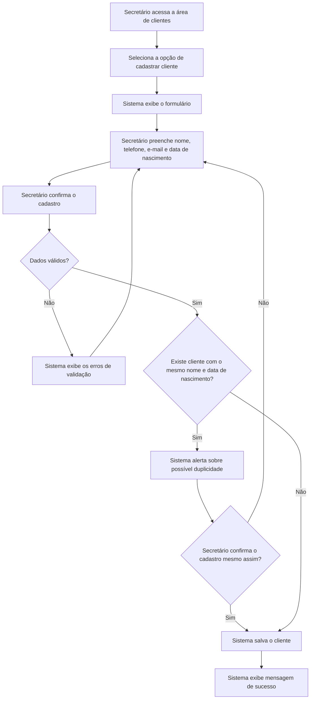
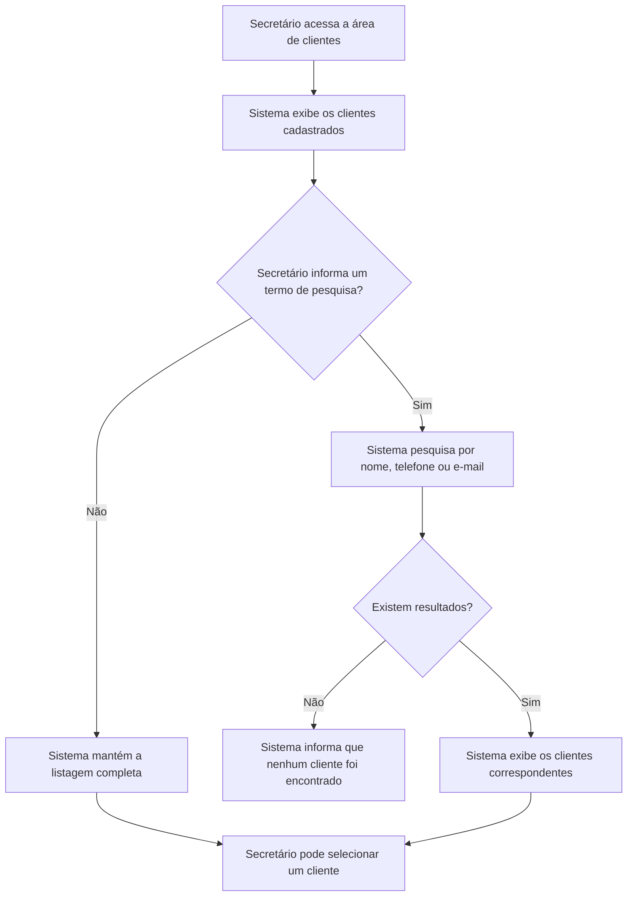
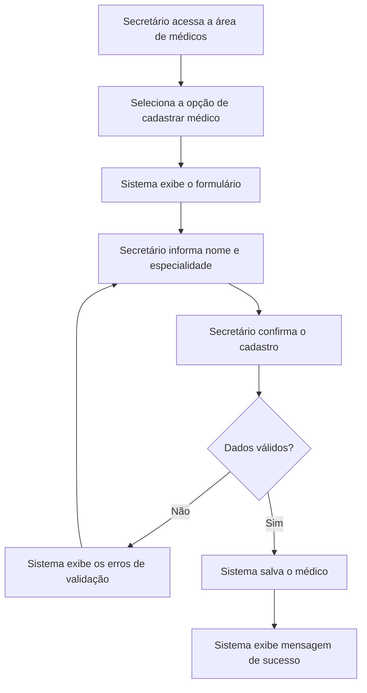
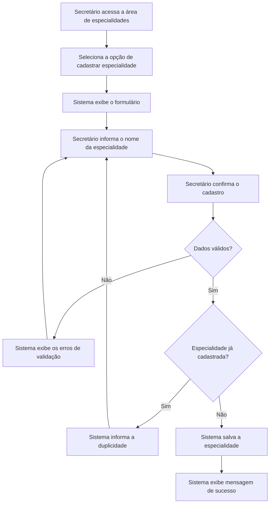
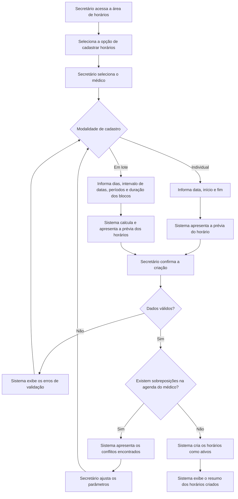
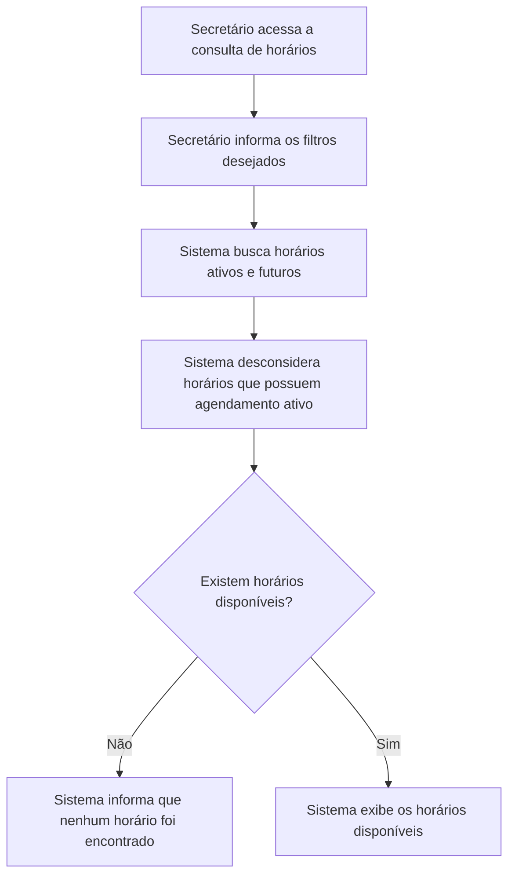
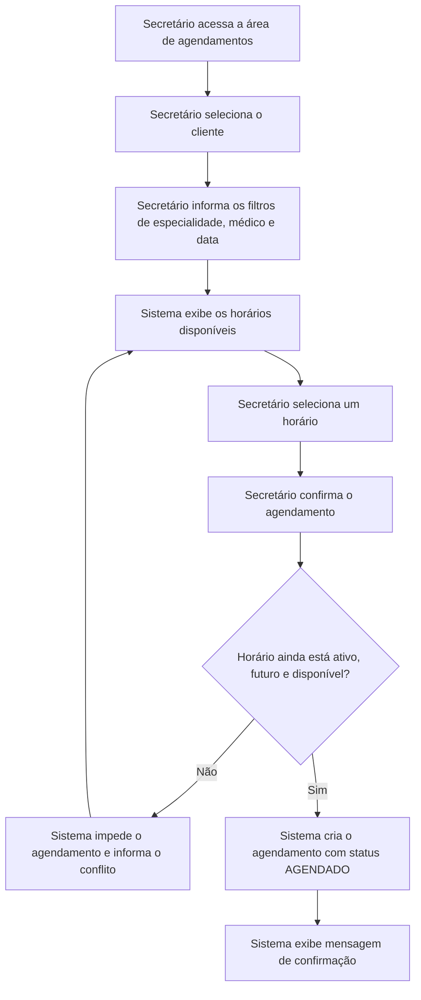
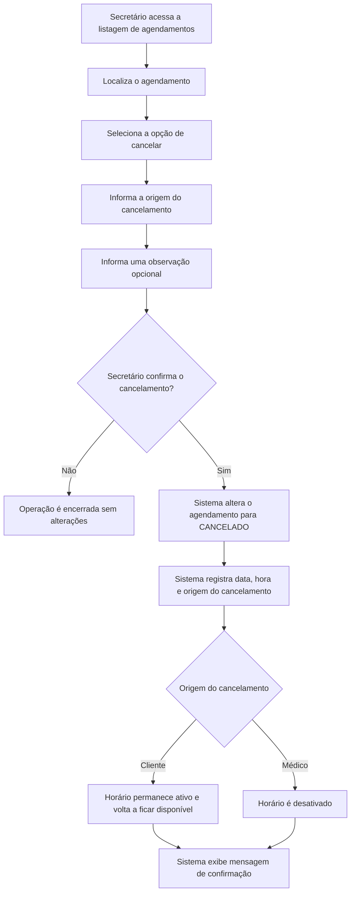
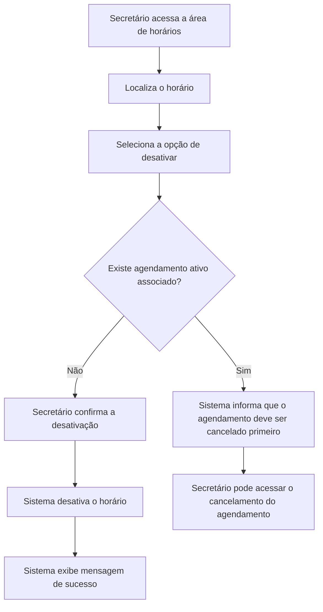
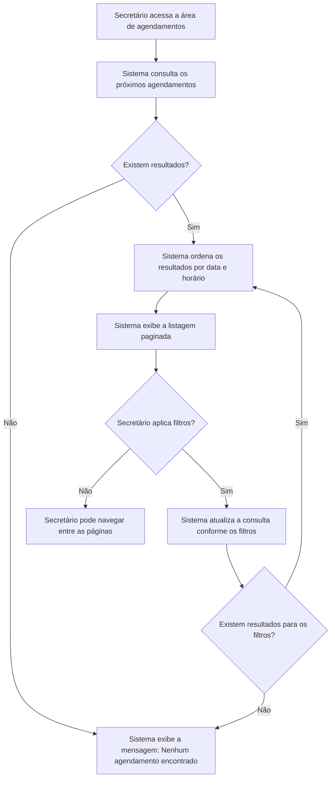

# Requisitos e Casos de Uso

## Requisitos

> Os requisitos identificados com `*` correspondem às funcionalidades obrigatórias definidas no desafio.

### Requisitos funcionais

#### Clientes

**RF01\* — Cadastrar cliente**

O sistema deve permitir o cadastro de clientes, contendo:

- nome;
- telefone;
- e-mail;
- data de nascimento.

**RF02 — Consultar clientes**

O sistema deve permitir listar e pesquisar os clientes cadastrados.

A pesquisa poderá ser realizada por:

- nome;
- telefone;
- e-mail.

#### Médicos e especialidades

**RF03 — Cadastrar médico**

O sistema deve permitir o cadastro de médicos, associando cada médico a uma especialidade.

**RF04 — Cadastrar especialidade**

O sistema deve permitir o cadastro e a consulta das especialidades utilizadas pela clínica.

#### Horários

**RF05\* — Cadastrar horários disponíveis**

O sistema deve permitir o cadastro dos horários em que cada médico estará disponível para atendimento.

O cadastro deverá permitir informar:

- médico;
- data;
- hora de início;
- hora de fim.

**RF06 — Consultar horários disponíveis**

O sistema deve permitir consultar os horários disponíveis, com filtros por:

- data;
- médico;
- especialidade.

**RF07 — Desativar horário**

O sistema deve permitir a desativação de um horário quando o médico não estiver disponível naquele período.

Horários desativados não devem ser apresentados como disponíveis para novos agendamentos.

**RF08 — Cadastrar conjunto de horários**

O sistema deve permitir o cadastro de múltiplos horários a partir de parâmetros definidos pelo Secretário, como:

- médico;
- dias da semana;
- intervalo de datas;
- horário inicial e final de cada período;
- duração de cada atendimento.

O sistema deverá dividir os períodos informados em blocos individuais de atendimento.

O cadastro individual de um único horário também deverá ser permitido.

#### Agendamentos

**RF09\* — Realizar agendamento**

O sistema deve permitir associar um cliente a um horário disponível de um médico.

Durante o agendamento, o Secretário deverá selecionar:

- cliente;
- médico;
- data;
- horário.

A especialidade poderá ser utilizada como filtro para facilitar a seleção do médico.

**RF10\* — Impedir conflitos de agendamento**

O sistema deve impedir que dois agendamentos ativos ocupem o mesmo horário de um mesmo médico.

Médicos diferentes poderão possuir agendamentos no mesmo período.

**RF11\* — Cancelar agendamento**

O sistema deve permitir o cancelamento de um agendamento ativo.

No momento do cancelamento, deverá ser informada sua origem:

- solicitação do cliente;
- indisponibilidade do médico.

Quando o cancelamento for solicitado pelo cliente, o horário deverá voltar a ficar disponível.

Quando o cancelamento ocorrer por indisponibilidade do médico, o horário deverá ser desativado.

**RF12\* — Listar próximos agendamentos**

O sistema deve apresentar uma listagem paginada dos próximos agendamentos, ordenada por data e horário.

A listagem deverá apresentar, no mínimo:

- cliente;
- médico;
- especialidade;
- data;
- horário;
- status.

**RF13 — Filtrar agendamentos**

O sistema deve permitir filtrar os agendamentos por:

- médico;
- especialidade;
- cliente;
- data ou intervalo de datas;
- status.

---

## Regras de negócio

**RN01 — Validade dos cadastros**

Os dados informados nos cadastros devem ser validados antes da persistência. Os campos obrigatórios devem estar preenchidos e os valores informados devem possuir formato e conteúdo válidos.

No cadastro de clientes, a combinação entre nome e data de nascimento deverá ser utilizada para identificar possíveis duplicidades.

Caso seja encontrada uma correspondência, o sistema deverá alertar o Secretário antes da conclusão do cadastro.

**RN02 — Associação entre médico e especialidade**

Todo médico deve estar associado a uma especialidade.

**RN03 — Validade dos horários**

Todo horário deve estar associado a um médico, possuir início anterior ao fim e não estar localizado no passado.

**RN04 — Conflitos na agenda do médico**

Um médico não pode possuir horários sobrepostos.

Médicos diferentes podem possuir horários no mesmo período.

Exemplo de conflito para um mesmo médico:

```text
14:00–15:00
14:30–15:30
```

Exemplo permitido:

```text
Médico A: 14:00–15:00
Médico B: 14:00–15:00
```

**RN05 — Disponibilidade de um horário**

Um horário será considerado disponível quando:

- estiver ativo;
- ainda não tiver ocorrido;
- não possuir agendamento com status `AGENDADO`.

A disponibilidade será calculada pelo sistema e não armazenada diretamente em um campo próprio.

**RN06 — Ocupação do horário**

Um horário pode possuir vários agendamentos históricos, mas somente um agendamento com status `AGENDADO` por vez.

A disponibilidade deverá ser verificada novamente pelo backend no momento da criação do agendamento.

**RN07 — Cancelamento solicitado pelo cliente**

Quando o cliente solicitar o cancelamento:

- o agendamento deverá receber o status `CANCELADO`;
- a data e a origem do cancelamento deverão ser registradas;
- o horário permanecerá ativo e voltará a ficar disponível.

**RN08 — Cancelamento causado pelo médico**

Quando o médico não puder realizar o atendimento:

- o agendamento deverá receber o status `CANCELADO`;
- a data e a origem do cancelamento deverão ser registradas;
- o horário correspondente deverá ser desativado.

**RN09 — Histórico de agendamentos**

Os agendamentos cancelados deverão permanecer registrados no sistema.

Um agendamento que já esteja cancelado não poderá ser cancelado novamente.

**RN10 — Cadastro de horários em lote**

No cadastro em lote, cada bloco de horário gerado deverá ser validado individualmente.

Caso sejam identificados conflitos, o sistema deverá informar os horários conflitantes antes de concluir a operação.

---

## Estados previstos

### Status do agendamento

Os estados previstos para um agendamento são:

- `AGENDADO`;
- `CANCELADO`;
- `CONCLUIDO`.

Os estados indispensáveis para as funcionalidades obrigatórias são `AGENDADO` e `CANCELADO`.

### Origem do cancelamento

A origem do cancelamento poderá assumir os seguintes valores:

- `CLIENTE`;
- `MEDICO`.

O status e a origem do cancelamento serão armazenados separadamente. Dessa forma, não será necessário criar estados distintos como `CANCELADO_PELO_CLIENTE` e `CANCELADO_PELO_MEDICO`.

---

# Casos de Uso

## UC01 — Cadastrar Cliente

**Ator:** Secretário

**Descrição:** Permite ao Secretário registrar um novo cliente no sistema para que ele possa ser associado posteriormente a agendamentos.

**Regra associada:** o sistema deve verificar possíveis duplicidades pela combinação entre nome e data de nascimento.



---

## UC02 — Consultar Clientes

**Ator:** Secretário

**Descrição:** Permite ao Secretário listar e pesquisar os clientes cadastrados para consultar seus dados ou selecioná-los durante outras operações do sistema.



---

## UC03 — Cadastrar Médico

**Ator:** Secretário

**Descrição:** Permite ao Secretário cadastrar um médico e associá-lo a uma especialidade.

**Pré-condição:** deve existir ao menos uma especialidade cadastrada.



---

## UC04 — Cadastrar Especialidade

**Ator:** Secretário

**Descrição:** Permite ao Secretário cadastrar uma especialidade utilizada pela clínica.



---

## UC05 — Cadastrar Horários Disponíveis

**Ator:** Secretário

**Descrição:** Permite cadastrar os períodos em que determinado médico estará disponível para atendimento, de forma individual ou em lote.

**Pré-condição:** deve existir ao menos um médico cadastrado.

### Modalidades de cadastro

- **Individual:** cria um único bloco de horário, informando data, início e fim.
- **Em lote:** gera vários blocos a partir de dias da semana, intervalo de datas, períodos de atendimento e duração de cada atendimento.

### Exemplos de cadastro em lote

- segundas e quintas, das 08h às 12h, com blocos de 1 hora;
- segundas e quartas, das 14h às 16h, com blocos de 30 minutos;
- quintas, das 15h às 18h, com blocos de 1 hora.



### Observação sobre o cadastro em lote

Cada bloco gerado deverá ser armazenado como um horário individual.

Por exemplo, um período das 08h às 12h, com duração de 1 hora, produzirá quatro horários:

```text
08:00–09:00
09:00–10:00
10:00–11:00
11:00–12:00
```

---

## UC06 — Consultar Horários Disponíveis

**Ator:** Secretário

**Descrição:** Permite consultar os horários que ainda podem receber agendamentos.



Os filtros poderão incluir:

- data;
- médico;
- especialidade.

---

## UC07 — Agendar Horário para Cliente

**Ator:** Secretário

**Descrição:** Permite associar um cliente a um horário disponível de um médico.

**Pré-condições:**

- deve existir ao menos um cliente cadastrado;
- deve existir ao menos um horário disponível.



A ocupação não será representada por uma alteração do horário para “ocupado”.

O horário deixará de ser apresentado como disponível devido à existência de um agendamento ativo associado.

---

## UC08 — Cancelar Agendamento

**Ator:** Secretário, registrando uma solicitação do cliente ou uma indisponibilidade do médico.

**Descrição:** Permite cancelar um agendamento existente. O comportamento do horário depende da origem do cancelamento.

**Pré-condição:** o agendamento deve possuir status `AGENDADO`.



---

## UC09 — Desativar Horário

**Ator:** Secretário

**Descrição:** Permite retirar um horário da disponibilidade do médico sem excluí-lo do sistema.

**Pré-condição:** o horário deve estar ativo.



---

## UC10 — Listar Próximos Agendamentos

**Ator:** Secretário

**Descrição:** Exibe os agendamentos futuros em ordem cronológica, permitindo localizar e acompanhar os próximos atendimentos.



A listagem deverá apresentar:

- cliente;
- médico;
- especialidade;
- data;
- horário;
- status.

Os filtros poderão incluir:

- médico;
- especialidade;
- cliente;
- data ou intervalo de datas;
- status.

A paginação deverá utilizar uma quantidade fixa de registros por página, definida durante a implementação.

---

# Rastreabilidade entre Requisitos e Casos de Uso

> Os requisitos identificados com `*` correspondem às funcionalidades obrigatórias definidas no desafio.

| Requisito funcional                       | Caso de uso relacionado                                                    |
| ----------------------------------------- | -------------------------------------------------------------------------- |
| RF01\* — Cadastrar cliente                | UC01 — Cadastrar Cliente                                                   |
| RF02 — Consultar clientes                 | UC02 — Consultar Clientes                                                  |
| RF03 — Cadastrar médico                   | UC03 — Cadastrar Médico                                                    |
| RF04 — Cadastrar especialidade            | UC04 — Cadastrar Especialidade                                             |
| RF05\* — Cadastrar horários disponíveis   | UC05 — Cadastrar Horários Disponíveis                                      |
| RF06 — Consultar horários disponíveis     | UC06 — Consultar Horários Disponíveis; UC07 — Agendar Horário para Cliente |
| RF07 — Desativar horário                  | UC09 — Desativar Horário; UC08 — Cancelar Agendamento                      |
| RF08 — Cadastrar conjunto de horários     | UC05 — Cadastrar Horários Disponíveis                                      |
| RF09\* — Realizar agendamento             | UC07 — Agendar Horário para Cliente                                        |
| RF10\* — Impedir conflitos de agendamento | UC05 — Cadastrar Horários Disponíveis; UC07 — Agendar Horário para Cliente |
| RF11\* — Cancelar agendamento             | UC08 — Cancelar Agendamento                                                |
| RF12\* — Listar próximos agendamentos     | UC10 — Listar Próximos Agendamentos                                        |
| RF13 — Filtrar agendamentos               | UC10 — Listar Próximos Agendamentos                                        |

## Cobertura das funcionalidades obrigatórias

| Funcionalidade obrigatória                            | Requisito funcional | Caso de uso                                                                |
| ----------------------------------------------------- | ------------------- | -------------------------------------------------------------------------- |
| Cadastro de clientes                                  | RF01\*              | UC01 — Cadastrar Cliente                                                   |
| Cadastro de horários disponíveis                      | RF05\*              | UC05 — Cadastrar Horários Disponíveis                                      |
| Agendamento de horário para um cliente                | RF09\*              | UC07 — Agendar Horário para Cliente                                        |
| Cancelamento de agendamento                           | RF11\*              | UC08 — Cancelar Agendamento                                                |
| Validação para impedir dois clientes no mesmo horário | RF10\*              | UC05 — Cadastrar Horários Disponíveis; UC07 — Agendar Horário para Cliente |
| Listagem dos próximos agendamentos                    | RF12\*              | UC10 — Listar Próximos Agendamentos                                        |

Todas as funcionalidades obrigatórias definidas no desafio possuem requisito funcional e caso de uso correspondente.
